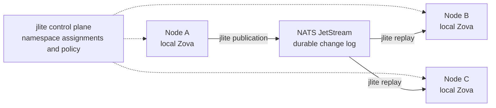

# jlite

A small distributed storage control layer built on **Zova** and **NATS JetStream**.

jlite lets independent Zova databases participate in one coordinated storage
system. Each node keeps a real local database, while jlite defines where state
belongs, who owns it, how changes reach other nodes, and how interrupted work
recovers.

**Zova is the local database. JetStream is the durable distributed log.
jlite is the control layer that makes them work together.**

The name means **JOAT Lite**. JOAT is the broader idea of unifying interchangeable
infrastructure components. jlite applies that philosophy to one fixed stack:
Zova + JetStream. That constraint keeps the project focused and gives it a clear
storage and coordination model.

**Development status:** the working v0 prototype implements local-first,
single-owner record replication. The broader design includes richer Zova state,
placement policies, consistency choices, and snapshot-based recovery; those
capabilities are separated from the implemented v0 scope below.

## Contents

- [Why jlite](#why-jlite)
- [Try the working prototype](#try-the-working-prototype)
- [The storage model](#the-storage-model)
- [Coordination and replication](#coordination-and-replication)
- [What works today](#what-works-today)
- [Operating the prototype](#operating-the-prototype)
- [Build and test](#build-and-test)
- [Batching measurements](#batching-measurements)
- [Project boundaries](#project-boundaries)
- [Source guide](#source-guide)

## Why jlite

One embedded database can keep an application simple. Once the application needs
state on several machines, it also needs placement, propagation, retry handling,
idempotency, synchronization, and recovery. The application otherwise has to
assemble those responsibilities itself.

jlite brings them into one distributed storage model while preserving local
transactions and local access to data. Its intended place is the step after
outgrowing one Zova database, before adopting a large distributed infrastructure
platform.

The guiding principle is that **a Zova database remains valid and useful on its
own**. Coordination sits above it. Nodes retain their local state rather than
becoming thin clients of a central database server.

## Try the working prototype

From the repository directory:

```sh
sh scripts/podman-demo.sh build
sh scripts/podman-demo.sh up
sh scripts/podman-demo.sh status
```

Requirements: Podman connected to a **Linux/amd64** engine, `jq`, `openssl`, and
a POSIX shell. The demo has been tested with Podman on macOS using a Fedora
remote. The build supplies Go 1.27.1 and the native dependencies.

The demo starts an authenticated broker and three jlite nodes: `owner`,
`replica`, and `other`, each with separate persistent storage. The owner
publishes a seed before the third node starts, demonstrating full replay into
an empty replica.

```sh
sh scripts/podman-demo.sh ctl owner put example-1 greeting hello
sh scripts/podman-demo.sh ctl owner get greeting
sh scripts/podman-demo.sh ctl replica get greeting
sh scripts/podman-demo.sh ctl other get greeting
```

Replica reads can lag; inspect the applied positions with `status` and repeat
the read after catch-up. Responses are JSON, with byte values base64-encoded.
`example-1` is the request ID: reuse it with the same payload for a retry, and
use a new ID for a new operation.

```sh
sh scripts/podman-demo.sh ctl owner delete example-2 greeting
sh scripts/podman-demo.sh verify
sh scripts/podman-demo.sh stop
```

`verify` stops the demo broker, commits an offline owner write, checks stale
replica reads, and checks convergence after restart. It updates the `document`
record. `stop` preserves storage and credentials; `up` restarts the same
containers. A rebuilt image does not replace existing containers automatically.

## The storage model

### Nodes and namespaces

A **node** combines a stable identity, local Zova storage, assigned namespaces,
and durable replication progress. Nodes can host different subsets of state;
every node does not need a complete copy of everything.

A **namespace** is the unit of distributed responsibility. It groups related
application state and gives that state a placement, ownership, and consistency
policy. Applications reason about namespaces such as `messages`, `media`, or
`project:alpha`, rather than treating every table or transport subject as a
separate distributed system.

The broader design allows a namespace to contain several of Zova's local
storage models together. For example:

```text
project:alpha
├── relational project metadata
├── source-file objects
├── vector embeddings
└── a symbol graph
```

jlite's intended responsibility is to distribute that namespace coherently.
Zova remains responsible for how its records, objects, vectors, graphs, and
extension-owned state are stored and transacted locally. The current prototype
exercises the distribution model with small keyed records; replication of the
other storage models is planned.

### Local state and distributed policy

Ordinary reads use the node's local Zova materialization. JetStream carries
changes and durable replay history; it is not the query engine for application
state.

Local atomicity comes from Zova. Distributed consistency belongs to the
namespace policy. The design includes owner-based, eventual, multi-writer, and
local-only policies. Multi-writer policies require explicit, deterministic
conflict rules; there is no universal merge rule that safely fits every data
model. The working v0 policy uses one fixed writer with eventual read replicas.

## Coordination and replication

jlite separates two responsibilities:

| Responsibility | What it governs |
| --- | --- |
| **Control plane — where state belongs** | Node identity and membership, namespace ownership, placement, replica assignments, and consistency policy. |
| **Data plane — how state gets there** | Durable changes, propagation, atomic application, acknowledgements, replay, catch-up, and snapshot synchronization. |

The owner-based replication path illustrates how those responsibilities fit
around the local databases:



The prototype implements static assignments and log replay. Dynamic membership,
placement changes, additional consistency policies, and snapshot synchronization
are parts of the broader design.

### Durable changes and replay

Every distributed change has a stable identity. Delivery may happen more than
once, but the same logical mutation must have only one effect in local state.
Mutation data and deduplication progress therefore commit in the same local
transaction, followed by delivery acknowledgement.

Replay is part of normal operation: a late node rebuilds its materialization,
and a returning node catches up from its durable position. The design also
calls for snapshot bootstrap followed by changes after the snapshot position,
so long-lived namespaces need not retain their entire history forever.
Snapshot bootstrap is not implemented in v0; it currently requires complete
retained history.

### Batching and backpressure

A coordinated local writer groups mutations into bounded transactions to
amortize commit overhead while preserving ordering and atomic boundaries.
Batch size, payload bytes, collection time, queued work, and durable backlog
have explicit limits. Overload produces backpressure or rejection instead of
an unbounded queue.

Batching improves use of one database's writer. Distribution across independently
owned namespaces supplies the model for scaling writes across databases and
nodes. Neither batching nor buffering creates parallel writers inside one
SQLite database.

## What works today

The v0 implementation establishes the first complete path through this design:

| Capability | Implemented behavior |
| --- | --- |
| Namespace placement | Static node identities, one fixed owner, and explicitly assigned replicas. |
| Local storage | One transactional Zova database per hosted namespace. |
| Mutations and retries | Put, delete, and get for small keyed records; durable request IDs and conflict rejection. |
| Propagation | Atomic local outbox, authenticated ordered publication, and independent durable replica consumers. |
| Recovery | Full replay, checkpoint-based catch-up, and duplicate recognition after reconnect or process crash. |
| Capacity | Bounded admission, transaction batches, outbox payloads, and retained stream storage. |
| Lifecycle and visibility | Clean shutdown, local progress, readiness, connection observations, backlog, and blocking errors. |

The runtime and demo are written in Go. The Go API is an integration surface
for the storage system: `OpenNode`, `Write`, `Get`, `Status`, and `Close` manage
one hosted namespace. Lower-level writer, publisher, replica, and consumer
interfaces support explicit scheduling. General assignments use `Config`;
the executable demo uses `project:alpha` with the three node IDs above.

## Operating the prototype

**Write completion is local.** Success means the owner committed the record,
retry result, sequence, and outbox entry atomically. Publication and replica
application happen afterward. A canceled write after admission may have an
unknown outcome; retry the identical request ID and payload to resolve it.

**Replica reads are eventually consistent.** A synchronized replica can serve
stale data during an outage. `Ready` means it reached its captured bootstrap
target, and `Connected` is its latest transport observation. Neither promises
that it matches the owner's current head. Status describes local knowledge.

**Capacity exhaustion is explicit.** Defaults include 64 KiB values, batches
of up to 500 operations or 1 MiB with a 10 ms collection window, 1,024 admitted
operations or 4 MiB of estimated wire bytes, and 64 MiB each for unpublished
outbox payloads and retained namespace stream storage. A full stream rejects
publication while retaining pending outbox work. These are payload and operation
limits, not total-process memory or physical SQLite-file ceilings. Retry
metadata is retained indefinitely in v0.

Request IDs are scoped to a namespace. An identical retry returns the original
committed sequence even if a later write changed or deleted that key. A new
operation needs a new ID. Owner request fingerprints/results and replica
change-ID ledgers grow with the number of logical writes; deletion of a record
does not remove its retry metadata. Outbox entries disappear after publication
checkpoint commit, but historical retry and replay metadata have no v0 pruning
policy. Budget disk for records, indexes, ledgers, WAL and retained stream data.

Batch collection limits preserve ordering and each request's atomic boundary.
Validation, request conflicts and capacity errors reject individual requests;
storage or commit failures fail the writer closed. Reopen the same database
before retrying. The collection window limits time spent forming a batch, not
end-to-end latency while queued or under overload. Batching shares the database's
single writer; independent namespace databases provide additional write lanes.

**Interrupted work has a durable recovery point.** Replicas acknowledge only
after mutation and checkpoint commit. Invalid changes, gaps, incompatible
versions, and missing pinned history block the namespace visibly. The system
refuses to skip changes or silently substitute a new database or stream.

Full retained history is required for both fresh replay and checkpoint recovery.
Namespace streams use finite byte capacity, discard-new retention, no automatic
age/message expiry, and disabled deletion/purge. Removing required history or
replacing the stream is a blocking failure; v0 has no snapshot fallback. Stop
publication before explicit stream maintenance. Any changed stream policy must
match the connection options; jlite does not silently resize or reset it.

**Identity and authorization are storage boundaries.** Broker authentication
and namespace-level subject permissions enforce who can publish. Message owner
fields and hashes alone grant no authority. The library requires authenticated
connections and TLS outside loopback. Deployments must enforce one active
instance per configured identity; local file locks do not provide distributed
fencing.

Install the allowlists returned by `PermissionsFor` on authenticated broker
users; client configuration cannot install or attest server ACLs. Replicas need
their own durable consumers and credentials. A copied database or a second
process under the same configured identity is not an ownership-transfer method.
`OpenNode` starts replication asynchronously, so inspect connection and blocking
status separately from a successful local commit.

The demo uses SQLite WAL with `synchronous=FULL` and one file-backed JetStream
server with `sync_interval: always`. It publishes no host ports; commands use
mode-0600 Unix sockets through `podman exec`. `Close()` resolves accepted local
work and preserves unpublished commits without waiting for remote convergence.
Durability checks cover process crashes with recoverable storage, not loss of
the owner's disk or correlated power loss.

## Build and test

Pinned dependencies are Go **1.27.1**, Zova Go/C ABI **1.1.0**, NATS Go client
**1.54.0**, and demo/test NATS server **2.15.0**.

For a native macOS build, install Go 1.27.1 and a C compiler, then run:

```sh
sh scripts/setup-zova.sh
sh scripts/go.sh build -o .local/jlite ./cmd/jlite
sh scripts/go.sh test -race -count=1 -v ./...
sh scripts/go.sh vet ./...
```

The scripts verify the native Zova archive and supply cgo include/library paths.
Verified development targets are macOS arm64 and Fedora Linux/amd64 through
Podman. The Linux Containerfile also supplies the isolated Zig 0.16 stack-probe
symbol needed to link Zova's release archive. Go and Zig stay in the build stage.

The Podman build runs the full race suite and vet. To build just that stage:

```sh
podman build --target build -f deploy/podman/Containerfile -t localhost/jlite:v0-failure-tests .
```

Tests use real Zova files and authenticated JetStream. They verify ordering,
atomic rollback, retries, full replay, outages, capacity exhaustion,
authorization, and identity checks. Explicit barriers and SIGKILL exercise
owner and replica process-crash recovery at transaction and acknowledgement
boundaries.

## Batching measurements

```sh
sh scripts/podman-benchmark.sh
```

The runner builds and verifies the Linux image, then measures non-race builds in
isolated processes on the configured Podman engine. It compares one-operation
transactions with bounded batches across 64-byte, 1 KiB and 16 KiB values, low
arrival rates and burst traffic, and repeats each case three times. Separate
overload samples measure rejection, backlog and process memory with publication
paused. Every sample verifies record contents and both replicas' final prefixes.

[Benchmark method and measured results](benchmarks/README.md) distinguish local
commit throughput from publication, replica lag and offline recovery. Raw results
include capacities, observed batch sizes, latency percentiles and storage/memory
measurements. These are synthetic workload measurements, not a throughput or
latency guarantee for an application.

## Project boundaries

jlite stays centered on Zova + JetStream and namespace-level coordination.
Interchangeable storage backends belong to the broader JOAT idea. Global SQL
serializability, transparent transactions across nodes, cluster scheduling,
and distributed computation are outside jlite's intended scope.

Within jlite's design, rich-state replication, snapshot bootstrap, dynamic
placement and membership, ownership changes, and additional consistency policies
remain future work. The prototype also has no HTTP/gRPC gateway, accepted-only
ingestion mode, RAM-only ingestion, arbitrary SQL replication, automatic
membership, namespace placement or owner failover. The current protocol
replicates keyed puts/deletes; it does not yet replicate Zova objects, vectors,
graphs or extension-owned state.

## Source guide

- [Namespace assignments and limits](config.go)
- [Node lifecycle and status](node.go)
- [Requests](request.go) and [versioned changes](protocol.go)
- [Local writer](writer.go) and [publication and authorization](publisher.go)
- [Replica storage](replica.go) and [replay](replica_consumer.go)
- [Demo runtime](cmd/jlite/main.go) and [Podman workflow](scripts/podman-demo.sh)
- [Crash recovery](failure_test.go), [overload](failure_limits_test.go), and [history checks](failure_history_test.go)
